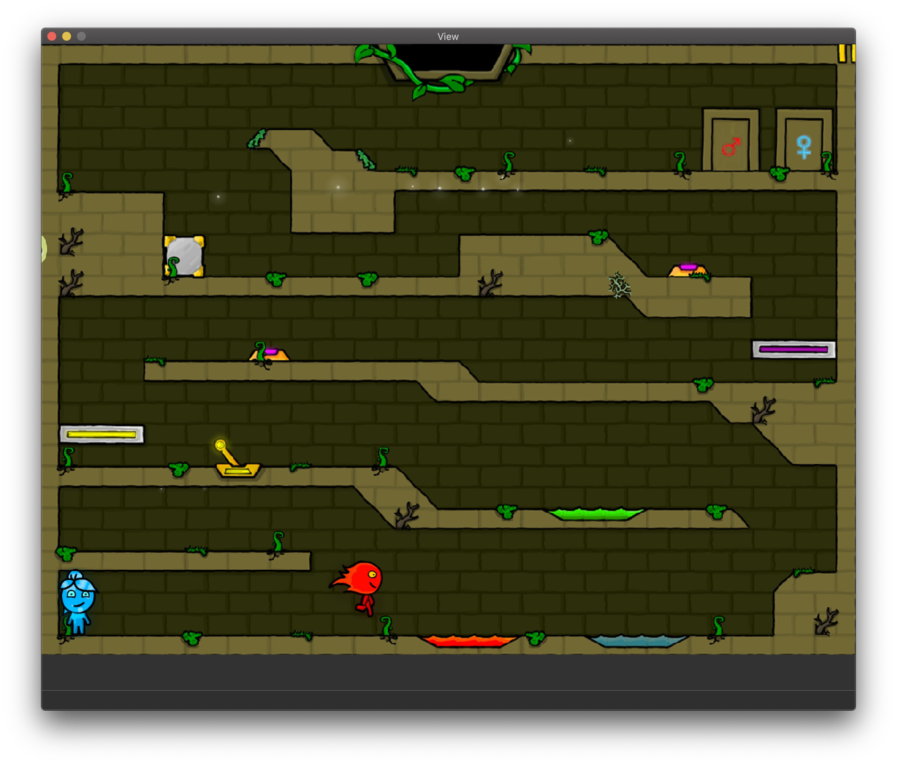
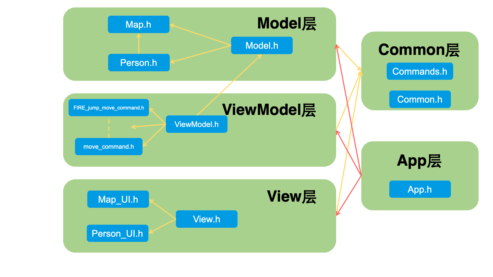
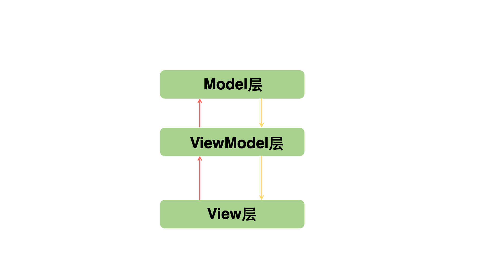
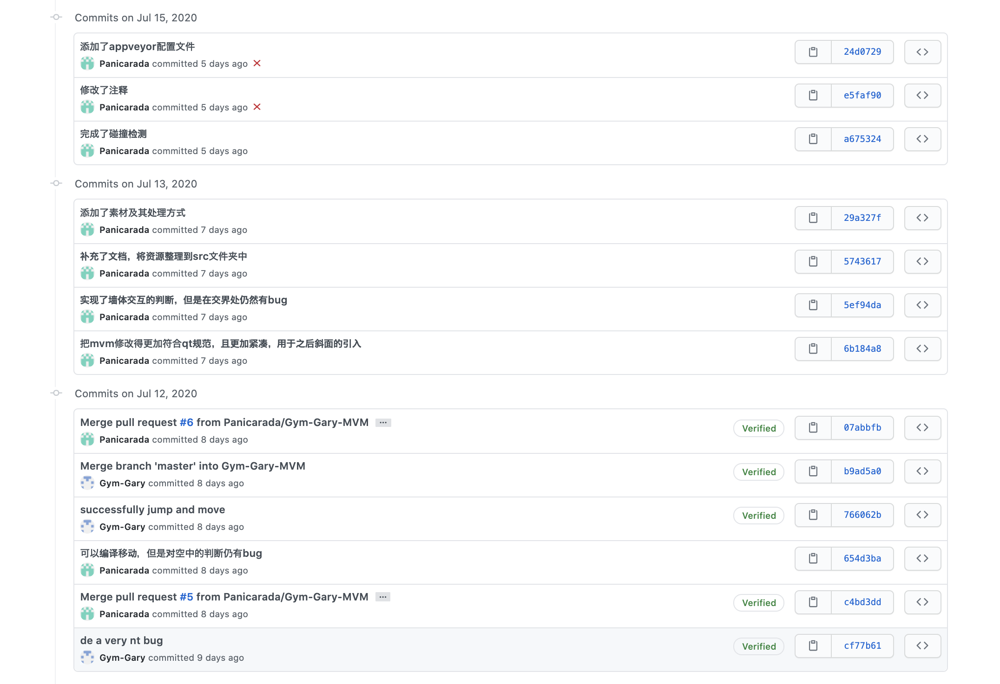
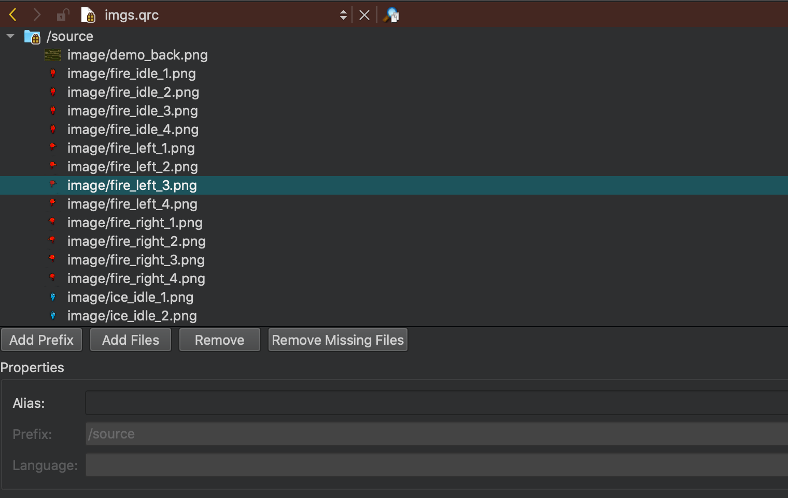

## 1. 程序说明

#### 1.1 Commn层

- `commands.h`：指令类`Commands`是连通View层与MVM层的桥梁，该头文件定义了指令的基类，所有实际使用的指令类继承自该类，并重载了执行指令的虚函数`void Commands::exec()`，用于改变其绑定的MVM实例。

- `Common.h`：定义了全局可能用到的宏定义和枚举类型。列举如下：

  `#define PERSONSIZE_X`：冰人、火人的宽度，用于碰撞检测

  `#define PERSONSIZE_Y`：冰人、火人的高度，用于碰撞检测

  `#define V_MOTIONLESS`：人物静止时的速度

  `#define V_JUMP`：人物起跳的初速度

  `#define V_MOVE`：人物左右移动的速度

  `#define DY_SPEED`：单位时间内Y方向速度的改变量，等同于重力

  `#define FALL_BOUND`：下落过程最大速度

  `enum GameStatus`：游戏状态

  `enum PersonType`：人物类型

  `enum WallType`：墙体类型

#### 1.2 Model层

##### 1.2.1 `Map.h`

实现了对游戏中墙实体的模型化。

（1）墙体类`Wall`，抽象为

```c++
class Wall
{
public:
    // 判断墙面和矩形rect是否相交
    Wall(const QLineF &&segment, const WallType &&wall_type);
    bool intersect(const QRectF &rect);
public:
    QLineF segment; // 墙体对应的线段
    WallType wall_type; // 墙体类型
};
```

（2）地图类`Map`，游戏地图在逻辑层面的抽象，主要储存用于碰撞检测所需记录的墙边集合，并提供了判断矩形与墙体碰撞（=相交）的方法。

```c++
class Map
{
public:
    Map();

    // 判断矩形是否与某一个墙体相交，是的话返回对应墙体指针，否则返回nullptr
    QSharedPointer<Wall_crashed_union> intersect(const QRectF & rect);
private:
    QSet<QSharedPointer<Wall>> walls_set; // 墙体集合
};
```

（3）五种类型墙体的结构，主要用于简化碰撞检测返回值。因为矩形可能同时与多种墙体碰撞，但是至多与同一种墙体碰撞一次（比如不会同时和两个地板相碰）

```c++
struct Wall_crashed_union
{ // 储存碰撞墙体的结构，同一类型的墙体只有可能一个发生碰撞
    QSharedPointer<Wall> left_block; // 左墙
    QSharedPointer<Wall> right_block; // 右墙
    QSharedPointer<Wall> ceil; // 天花板
    QSharedPointer<Wall> floor; // 地板
    QSharedPointer<Wall> slope; // 斜坡
};
```

##### 1.2.2 `Person.h`

实现了对游戏中人物的模型化。其中人物所对应数据被抽象为一个矩形。提供了改变人物速度、位置，以及判断是否在空中的方法。

```c++
class Person
{
public:
    Person() = delete; // 拒绝空构造器
    Person(QSharedPointer<Map> &map);
    // 设置人物位置
    void set_pos(const QPoint &&pos) noexcept;
    void set_pos_x(const double &&pos_x) noexcept;
    void set_pos_y(const double &&pos_y) noexcept;
    // 设置人物速度
    void set_speed(const QPoint &&speed) noexcept;
    void set_speed_x(const double &&speed_x) noexcept;
    void set_speed_y(const double &&speed_y) noexcept;
    QPoint get_pos() noexcept;
    QPoint get_speed() noexcept;
    const bool& isAerial() noexcept; // 是否在空中
    void move();
private:
    QPointF m_speed; // 人的速度
    QPointF m_pos; // 人的位置，用左上角的点记录
    QSharedPointer<Map> m_map; // 指向地图的指针
    bool m_isAerial; // 是否在空中
    QRectF rect; // 人所对应的矩形，m_pos是其左下角
};
```

##### 1.2.3 `Model.h`

实现了对游戏中各种组件的整合，提供了供ViewModel层使用的控制模型的接口。

```c++
class Model
{
public:
    Model() noexcept;
    // 设置对应人物的速度
    void set_speed(double v_x, double v_y, PersonType &&type) noexcept;
    // 设置对应人物x方向的速度
    void set_speed_x(double v_x, PersonType &&type) noexcept;
    // 设置对应人物y方向的速度
    void set_speed_y(double v_y, PersonType &&type) noexcept;
    // 获取对应人物的位置
    const QPoint &get_pos(PersonType &&type) noexcept;
    // 获取对应人物的速度
    const QPoint &get_speed(PersonType &&type) noexcept;
    // 判断对应人物是否在空中
    const bool &isAerial(PersonType &&type) noexcept;
    // 间隔刷新的move函数
    void Move() noexcept;
private:
    QSharedPointer<Map> m_map;
    QSharedPointer<Person> ice_person;
    QSharedPointer<Person> fire_person;
};
```

#### 1.3 ViewModel层

##### 1.3.1 `ViewModel.h`

主要用于连接指令类`Commands`与模型类`Model`，让指令能够调用Model层提供的对应控制模型的方法。同时为View层提供了访问Model层数据的接口（比如人物位置、速度），这一接口在App层会被绑定至View层对应的仿函数上。

```c++
class ViewModel
{
public:
    ViewModel() noexcept;
    const QPoint& get_ice_pos();
    const QPoint& get_fire_pos();
    const QPoint& get_ice_speed();
    const QPoint& get_fire_speed();
    void Exec_Ice_left_command();
    void Exec_Ice_right_command();
  	... ...
    // 构造并绑定命令指针
    void setup_command(QSharedPointer<ViewModel> vm);
  
    // 获取命令指针
    QSharedPointer<Commands> get_fire_jump_move_command();
    QSharedPointer<Commands> get_fire_left_move_command();
    ... ... 
private:
    QSharedPointer<Model> m_model; // 指向对应模型的指针
    // 指向各种命令的指针
    QSharedPointer<Fire_jump_move_command<ViewModel>> fire_jump_move_command;
    QSharedPointer<Fire_left_move_command<ViewModel>> fire_left_move_command;
    ... ...
};
```

##### 1.3.2 `具体指令_command.h`

以`move_command.h`为例，该指令的作用是根据人物目前的速度对人物的位移进行改变，所有指令的实现都需要调用游戏中ViewModel，为了避免文件的相互依赖导致编译错误，在具体指令定义时ViewModel是作为类模板(template)出现，通过方法` ViewModel::setup_command(QSharedPointer<ViewModel> vm)`绑定到具体的ViewModel实例上。

```c++
template <class ViewModel>
class Move_command :public Commands
{
public:
    Move_command(QSharedPointer<ViewModel> vm) { m_VM = vm; }
    void exec() override
    {
        m_VM->Exec_move_command();
    }
private:
    QSharedPointer<ViewModel> m_VM;
};
```

#### 1.4 View层

##### 1.4.1 `map_ui.h`

游戏地图在视觉层面的抽象，主要提供了地图的绘制方法。

```c++
class Map_UI : public QWidget
{
    Q_OBJECT
public:
    explicit Map_UI(QWidget *parent = nullptr);
    void paint(QPainter &,int width, int height);
private:
    QPixmap img; // 地图图像
};
```

##### 1.4.2 `person_ui.h`

人物在视觉层面的抽象，主要提供了人物的绘制方法。

```c++
// 人物形态
enum PersonStatus
{
    turningLeft, // 朝向左
    turningRight,
    Facing, // 面对玩家
};

// 人物
class Person_UI : public QWidget
{
    Q_OBJECT
public:
    explicit Person_UI(const PersonType &&person_type, QWidget *parent = nullptr);
    void paint(QPainter &, int Frame); // 人物在不同帧下的绘制方法
    void set_pos(const QPoint &pos);
    void set_speed(const QPoint &speed);
    void set_status(const PersonStatus &&status);
private:
    QPoint pos; // 位置
    QPoint speed; // 速度
    PersonType person_type; // 人物类型
    PersonStatus person_status; // 人物形态

    // 图像数据声明为静态数组
    std::array<QPixmap, 4> idle_pics; // 静止时的图像
    std::array<QPixmap, 4> left_pics; // 向左运动时的图像
    std::array<QPixmap, 4> right_pics; // 向右运动时的图像
};
```

##### 1.4.3 `View.h`

各种视觉组件的整合，接收界面的反馈，并适时触发ui的改变与绘制。定义了指令接口与仿函数接口，分别用于触发模型的改变，以及获取模型当前信息，进而调整视觉效果。

```c++
QT_BEGIN_NAMESPACE
namespace Ui { class View; }
QT_END_NAMESPACE

class View : public QMainWindow
{
    Q_OBJECT
public:
    View(QWidget *parent = nullptr);
    ~View() override;
  	// 绑定命令的方法
    void set_game_status_command(QSharedPointer<Commands>);
    void set_ice_jump_command(QSharedPointer<Commands>);
    ... ...	
    // 绑定仿函数的方法
    void set_get_ice_pos(const std::function<QPoint(void)>&&);
    void set_get_fire_pos(const std::function<QPoint(void)>&&);
    ... ...
protected:
    void keyPressEvent(QKeyEvent *event) override; // 键盘按下事件
    void keyReleaseEvent(QKeyEvent *event) override; // 键盘松开事件
    void paintEvent(QPaintEvent *) override; // 绘制事件，通过update()函数激活
    void mousePressEvent(QMouseEvent *event) override; // 鼠标点击时间
private slots:
    void move(); // 每隔一段时间就触发move_command
private:
    Ui::View *ui;
  	// ui组件
    QSharedPointer<Person_UI> ice_person; // 冰人
    QSharedPointer<Person_UI> fire_person; // 火人
    QSharedPointer<Map_UI> map; // 地图
    QSet<Qt::Key> keys_pressed; // 被按下的所有按键
    QSharedPointer<Commands> game_status_command; // 游戏状态指令
    QSharedPointer<Commands> ice_jump_command; // 冰人跳跃指令
    ... ...
    std::function<QPoint(void)> get_ice_pos; // 获取冰人位置
    std::function<QPoint(void)> get_fire_pos; // 获取火人位置
    ... ...
    QTimer* timer;
    int curFrame; // 用于绘制地图，记录帧数
};
```

#### 1.5 App层

整合MVM层以及View层，并实现View层与MVM层的连接（绑定命令和仿函数），并实现游戏程序的启动。

##### 1.5.1 `App.h`

```c++
class App
{
public:
    App();
    void run();
private:
    QSharedPointer<View> view;
    QSharedPointer<Model> model;
    QSharedPointer<ViewModel> view_model;
};
```

##### 1.5.2 `App.c`

```c++
App::App()
{
    model = QSharedPointer<Model>::create();
    view_model = QSharedPointer<ViewModel>::create();
    view_model->setup_command(view_model);
    view = QSharedPointer<View>::create();

    view->resize(1200, 900); //分辨率


    /* 将command绑定到view层 */
    view->set_fire_jump_command(view_model->get_fire_jump_move_command());
    view->set_fire_left_command(view_model->get_fire_left_move_command());
    view->set_fire_right_command(view_model->get_fire_right_move_command());
    view->set_ice_jump_command(view_model->get_ice_jump_move_command());
    view->set_ice_left_command(view_model->get_ice_left_move_command());
    view->set_ice_right_command(view_model->get_ice_right_move_command());
    view->set_move_command(view_model->get_move_command());
  
  	// 利用lambda表达式对仿函数进行绑定
    view->set_get_ice_pos([&]()
    {
        return view_model->get_ice_pos();
    });
    view->set_get_fire_pos([&]()
    {
        return view_model->get_fire_pos();
    });
    view->set_get_ice_speed([&]()
    {
        return view_model->get_ice_speed();
    });
    view->set_get_fire_speed([&]()
    {
        return view_model->get_fire_speed();
    });
}
void App::run()
{
    view->show();
}
```

#### 1.6 部分效果图



## 2. 工程架构

#### 2.1 文件依赖图



#### 2.2 层间信号关系



`View -> ViewModel`：View层接受界面反馈信号（主要是键盘控制和计时器），触发ViewModel层的更新。

`ViewModel -> Model`：ViewModel层把更新信号传至Model层，在Model层中真正实现对数据的更新。

`Model -> ViewModel`：更新结束后，Model层反馈更新信号（比如位置发生变化后，反馈重新绘图的信号），先传至中介ViewModel层。

`ViewModel -> View`：ViewModel把Model更新的信号传至View层，触发界面的响应更新（比如人物位置发生变化后，重新绘制）。

## 3. 协作情况

#### 第一轮迭代

邱泽鸿：View层 + App层，

管元铭：Model层 + ViewModel层

李吉洋：文档攥写 + 素材搜集

#### 第二轮迭代

邱泽鸿：Model层 + ViewModel层

管元铭：App层 + 文档攥写

李吉洋：View层

#### 总结

每一轮迭代中，组内成员分工明确，程序间互不干预。组长直接向工程的master分支提交代码，组员通过向其他分支提交代码+pull request的形式提交代码，经组长检查冲突后再合并到主分支中。通过MVVM架构编写的工程使得我们不必等待对方代码的完成，便可以直接编写各自部分并编译测试，极好地提高了协作效率。

**部分代码提交记录展示：**



## 4. 技术难点

#### 4.1 碰撞检测及处理

为了保证游戏中人物的正常运动，我们必须在人物运动的事实对其和墙壁的关系进行检测和处理。为了避免穿模，我们主要采取的处理方式为：检测人物在当前时刻碰撞的墙体，然后根据人物当前速度对其做一个虚的位移，如果人物还与这些墙体发生碰撞（我们假设了两个时刻位移间距足够小，人物不足以碰到其他的墙体或是穿过墙体），那么就撤回这一位移，并对人物当前的速度做矫正，再根据新的速度实行位移。之后不必再检测碰撞，因为速度经修正后保证了运动的合理性。修正方式与墙体类型有关：

（1）如果与地板(FLOOR)碰撞：说明此时人物在地面上，因此人物不能够向下运动（但如果`y`分量的速度向上，则不受影响）

（2）如果与左墙(LEFT_BLOCK)发生碰撞：人物不能够向左运动（但如果`x`分量的速度向右，则不受影响）

（3）如果与右墙(RIGHT_BLOCK)发生碰撞：人物不能够向右运动（但如果`x`分量的速度向左，则不受影响）

（4）如果与天花板(CEIL)发生碰撞：人物不能够向上运动（但如果`y`分量的速度向下，则不受影响）

（5）如果与斜坡(SLOPE)发生碰撞：这一点解释了我们为什么要采用“虚位移”的手段。因为在斜坡上平走（无跳跃）时，我们希望人物可以沿着斜坡运动，并受到斜坡相应的下滑力；但如果在斜坡上强制限定速度方向，就会导致玩家在斜坡上无法跳跃。引入虚位移的话，玩家在斜坡上跳跃后的一瞬间就不会与墙体发生碰撞；如果没有跳跃，而是左右移动，则会与斜坡再次发生碰撞，我们在这时候退回去，把速度修正为沿着斜坡方向即可。

以下为碰撞处理部分的源代码：

```c++
void Person::move()
{
    // 检测碰撞
    auto crashed_walls = m_map->intersect(rect);
    // 受重力影响，y方向速度增大（向下）
    m_speed += QPointF(0, DY_SPEED);

    if (crashed_walls == nullptr)
    { // 说明人物在空中，
        if (m_speed.y() >= FALL_BOUND)
        { // 下落速度过快，进行限制
            m_speed.setY(FALL_BOUND);
        }
        m_pos += m_speed; // 位置在这一时刻根据速度改变
        rect.moveTopLeft(m_pos); // 根据人物位置移动矩形
        m_isAerial = true; // 在空中
    }
    else
    {
        // 和墙体碰撞
        if (crashed_walls->floor)
        { // 和地板碰
            m_isAerial = false;
            if (m_speed.y() > 0)
            { // 阻止向下运动
                m_speed.setY(0);
            }
        }
        else if (crashed_walls->slope)
        { // 不和地板碰时，才会考虑斜面
            m_isAerial = false;
            // 先按照现在的速度移动
            m_pos += m_speed;
            rect.moveTopLeft(m_pos);
            if (crashed_walls->slope->intersect(rect))
            { // 这么移动后会穿模
                // 位置退回来
                m_pos -= m_speed;
                rect.moveTopLeft(m_pos);

                // 只保留速度在斜坡上的分量
                QPointF slope_vec = crashed_walls->slope->segment.p2() - crashed_walls->slope->segment.p1(); // 斜坡对应的向量
                double length = crashed_walls->slope->segment.length();

                double slope_speed_project = QPointF::dotProduct(slope_vec/length, m_speed); // 计算目前速度在斜坡上分量大小
                // 用分量大小乘上下坡对应的单位向量，得到新的速度
                m_speed = slope_speed_project * (slope_vec / length);

                // 受到一个沿着斜坡的下滑力
                if (crashed_walls->slope->segment.p2().y() < crashed_walls->slope->segment.p1().y())
                { // 如果第二个点比较高，则下滑力和斜坡正方向相反
                    slope_vec = -slope_vec;
                }
                m_speed +=  10 * (slope_vec / length) * DY_SPEED * qSin(crashed_walls->slope->segment.angle());
            }
            else // 不会穿模
            { // 不改变现有速度，但是暂且退回去
                m_pos -= m_speed;
                rect.moveTopLeft(m_pos);
            }
        }
        if (crashed_walls->ceil)
        { // 和天花板碰撞
            if (m_speed.y() < 0)
            { // 阻止想上运动
                m_speed.setY(-0/8 * m_speed.y());
            }
        }
        if (crashed_walls->left_block)
        {
            // 先按照现在的速度移动
            m_pos += m_speed;
            rect.moveTopLeft(m_pos);
            if (crashed_walls->left_block->intersect(rect))
            { // 这么移动后会穿模
                // 退回来
                m_pos -= m_speed;
                rect.moveTopLeft(m_pos);
                m_speed.setX(0);
                if (!m_isAerial)
                { // 如果此时不在空中，y方向速度也变为0
                    m_speed.setY(0);
                }
            }
            else
            {
                // 退回来
                m_pos -= m_speed;
                rect.moveTopLeft(m_pos);
            }
        }
        if (crashed_walls->right_block)
        {
            // 先按照现在的速度移动
            m_pos += m_speed;
            rect.moveTopLeft(m_pos);
            if (crashed_walls->right_block->intersect(rect))
            {
                // 退回来
                m_pos -= m_speed;
                rect.moveTopLeft(m_pos);
                m_speed.setX(0);
                if (!m_isAerial)
                { // 如果此时不在空中，y方向速度也变为0
                    m_speed.setY(0);
                }
            }
            else
            {
                // 退回来
                m_pos -= m_speed;
                rect.moveTopLeft(m_pos);
            }
        }

        m_pos += m_speed;
        rect.moveTopLeft(m_pos); // 根据人物位置移动矩形
    }

//    qDebug() << m_isAerial;
    // 左右方向的移动是即时性的，若下一时刻没有按左右移动键，x方向上即刻停下
    m_speed.setX(V_MOTIONLESS);
}
```

#### 4.2 素材的使用和添加

Qt工程无法直接使用相对路径访问素材文件，经过搜索后发现，需要在Qt特有的"Resource"文件中添加文件以及前缀才可以使用相对路径。



#### 4.3 Commands与ViewModel的相互依赖

Commands部分提供View层改变模型数据的接口，其执行函数`Commands::exec()`需要调用其指向的ViewModel实例，这表明Commands的派生类依赖于ViewModel类。但是在`App`层中，我们只能对Model、ViewModel、View三个类进行实例的构造，所以需要在ViewModel中储存对应的指令指针，以绑定到View层，这表明ViewModel层又依赖于Commands的派生类。为了解决这种文件间的相互依赖，我们把ViewModel作为Commands派生类的模板输入。在构造好ViewModel实例后再用其作为输入对Commands的派生类进行构造和绑定。

## 5. 心得

#### 管元铭

在学习这个课程之前完全没有什么程序的框架的概念。上学期oop大作业的报告中要求说明程序框架，当时我就什么都不懂胡说了一通，而且在实际编程中也是互相等待，用qq互相传递代码，完全没有版本控制，经常出现一个同学更新了代码但其他同学还在用旧版或是误用了旧版代码的情况。
另外我也是第一次使用Qt，在代码中还有很多不符合Qt风格的地方，非常感谢另外两位组员对我的帮助，帮我把代码改的更加符合Qt风格。

#### 李吉洋

之前在C大程课上也进行过小组合作开发，但是那个时候主要还是依赖于QQ互相进行文件传输，哪里做了改动也只是在群里说一声，没有一个完整的存档来记录开发中的过程，而且当时也缺少降低模块间耦合度的意识，所以在协作的时候也确实遇到了一些互相等待的问题。

通过这两次迭代，确确实实让我认识到了MVVM模式的便捷之处。模块间的低耦合对于协作开发来说确实很有优势，每个人可以专注于自己负责的模块而不必互相等待，提高了效率。各个层的分离也使得每个模块的功能更加明确，代码更加易于维护。我也学习到了C++的一些非常有用的特性，比如智能指针等等，还有一些编程规范，对于提高代码质量还是很有帮助的。也让我知道了C++适合做什么，不适合做什么。此外，本次课程也让我对于Latex、Markdown还有AppVeyor等等一些其他有用的工具有了更多的接触，学到了一些新技能。

最后非常感谢组里的另外两位同学对我的照顾，由于之前没有接触过Qt，所以在第一轮迭代开始的时候有点拖进度了，但是其他两位同学耐心的帮我讲了很多，遇到问题也会一起尝试解决，也让我逐渐理解了Qt的思路，在后面迭代的时候更加得心应手。

#### 邱泽鸿

此前在OOP大作业中也使用过Qt编写了一个GUI程序，但是当时对项目框架没有概念，更不知道MVVM这一编程范式，因此对界面的逻辑处理以及相应的对实例改动的触发都写到了一个文件上（MainWindow），而且对模型的定义都采用了继承的形式，尽管只有两个人一个小组，也感受到了文件架构的混乱，并且这样的文件架构导致我们很多时候会同时修改某些文件，在提交代码时经常产生冲突，对冲突的处理非常耗时。

这次工程的编写首先是提高了我对Qt编程的熟悉度，更重要的是让我对MVVM模式产生了很深的理解，并深刻体会到了其便利性。这次工程采用的MVVM的编程模式帮我们实现了文件的解耦，使得组员可以各自编写不同的部分，并且编译测试（尽管不可能出现最终的结果），这样可以大大降低代码提交时冲突以及出错的可能性，很大程度上提高了我们的协作效率。

#### 总结

MVVM编程模式实现了对文件的解耦，使得我们在各个模块的程序编写可以同时进行，又可以各自编译（只是要注释掉未被连接接口的使用），保证了我们程序的正确性以及协同合作的高效性。事实上，在每轮迭代App层完成连接后，程序都可以编译通过并运行，出现的错误都是出现在一些细节，配合运行结果可以很容易地进行debug。

本次的合作编程也是实践MVVM非常宝贵的一次经验，它帮助我们提前熟悉了今后在进行大工程编写的规范流程，将给我们带来极大的帮助。